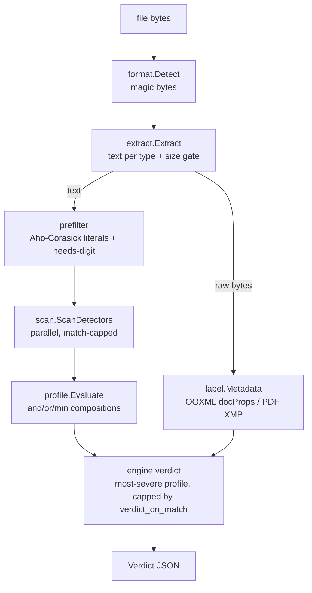
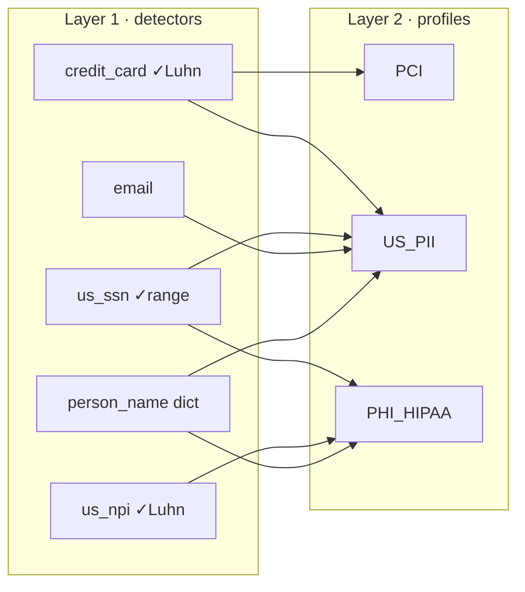
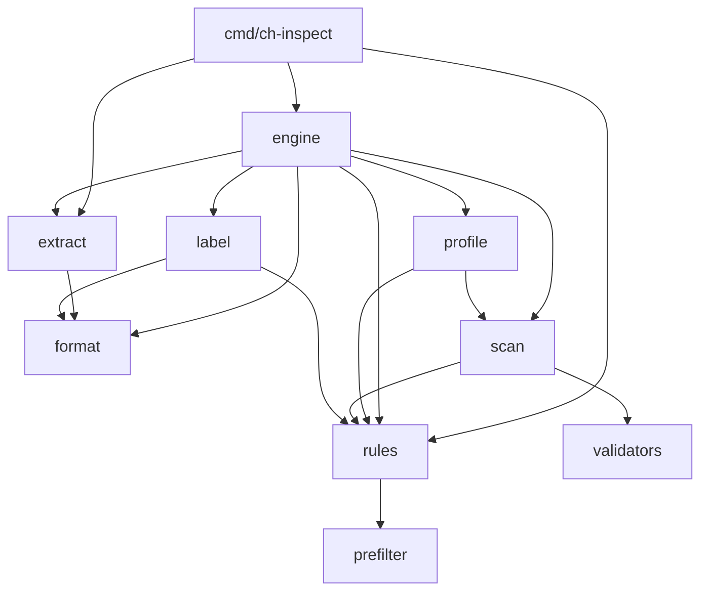

# Architecture

`endpoint-ci` is a local content-inspection engine: given a file, it detects
sensitive data types, composes them into named profiles, and returns an
**ALLOW / BLOCK / ESCALATE** verdict — entirely offline.

## Inspection pipeline



Key points:
- **Format detection** is by magic bytes (`%PDF`, `PK\x03\x04` → OOXML, `D0CF11E0`
  → OLE/encrypted, else UTF-8 text).
- **Extraction** turns a file into inspectable text: plaintext directly, OOXML via
  `archive/zip` + tag stripping, PDF via the text layer. Files over the **size gate**
  are reduced to head+tail windows (`Partial`).
- The **label fast-path** runs on the *raw* container (document properties / XMP
  packet), independent of body extraction — so a labelled-but-unparseable file is
  still caught.
- Detectors run in **priority-ordered batches** with **early-exit**: once a BLOCK
  verdict is decided, remaining detectors are skipped.

## Two-layer detection model

Breadth (PII, HIPAA, PCI…) comes from *composition*, not from giant patterns.



- **Detector** — one recognisable data type: an RE2 pattern (or a dictionary
  gazetteer for names) + optional checksum validator + context keywords. Emits a
  confidence score and a `fired` flag.
- **Profile** — a boolean tree (`and` / `or min=N` / `detector` with
  `min_validated` / `min_count`) over fired detectors. Emits a verdict capped by its
  `verdict_on_match` ceiling.

Confidence model (`config/rules.json → confidence_model`): start at the detector's
`base_confidence`, `+10` if a validator passes, `+5` if a context keyword is near a
match, `+5` per extra match (max 3); a detector fires at ≥ `default_fire_threshold`
(50). A profile BLOCKs at ≥ `block_threshold` (65), else ESCALATEs — then capped by
its ceiling (e.g. `EMAIL` caps at ESCALATE).

## Package dependency graph



`engine` orchestrates; everything below it is a focused, independently-testable unit.
`format`, `validators`, and `prefilter` are leaves (standard library only). The sole
third-party dependency (`ledongthuc/pdf`) is used only inside `extract`.

| Package | Responsibility |
|---|---|
| `rules` | load `rules.json`, classify pattern RE2-compatibility, build the prefilter automaton |
| `format` | magic-byte file-type detection |
| `extract` | text extraction per type + size gate / head-tail |
| `prefilter` | Aho-Corasick multi-literal matcher (skip detectors that can't match) |
| `scan` | run detectors (parallel, match-capped), apply validators + confidence |
| `validators` | deterministic checksums (Luhn, IBAN, ABA, SSN, NPI, NIR, …) |
| `profile` | evaluate composition trees over detector results |
| `label` | sensitivity-label detection (OOXML docProps, PDF XMP, body) |
| `engine` | pipeline orchestration, early-exit, verdict assembly |

## Verdict assembly

```
disposition = ALLOW
for each matched profile m:
    d = (m.confidence >= block_threshold) ? BLOCK : ESCALATE
    d = min(d, m.verdict_on_match)          # ceiling, e.g. EMAIL → ESCALATE
    disposition = max(disposition, d)        # most severe wins
# then: metadata label → BLOCK; body label → ≥ESCALATE;
#       partial/truncated coverage + ALLOW → ESCALATE
```

The PoC **reports** the verdict; it never enforces.

## Performance & robustness mechanisms

- **Prefilter** (one Aho-Corasick pass) skips detectors whose literal cue / digit
  requirement is absent.
- **Match cap** (`FindAllStringIndex(text, 64)`) stops scanning once enough matches
  exist — we don't need all 2,000 cards to know it's PCI.
- **Parallel scan** across `NumCPU` (detectors are independent & read-only).
- **Early-exit**: priority-ordered batches; stop when a BLOCK is decided or matches
  saturate `max_total_matches`.
- **Size gate** bounds work on huge files; **process isolation** in `--scan` bounds
  the blast radius of a malicious file (e.g. a PDF that OOMs the parser).

See [`engine-notes.md`](./engine-notes.md) for measured numbers and findings, and
[`../CONTRIBUTING.md`](../CONTRIBUTING.md) for how to add detectors/profiles.
