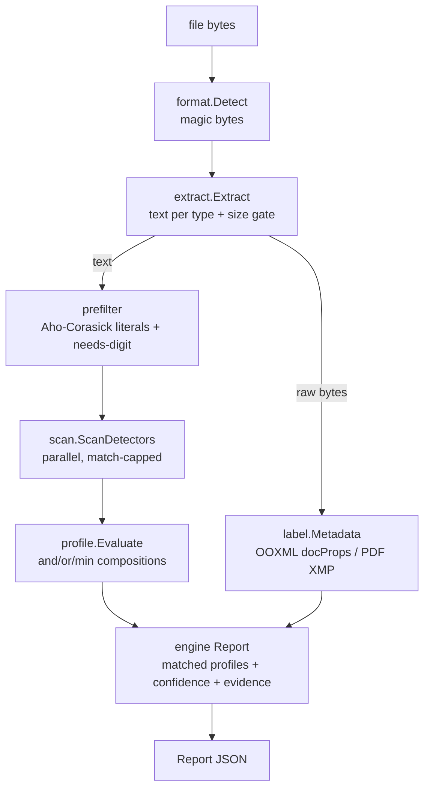
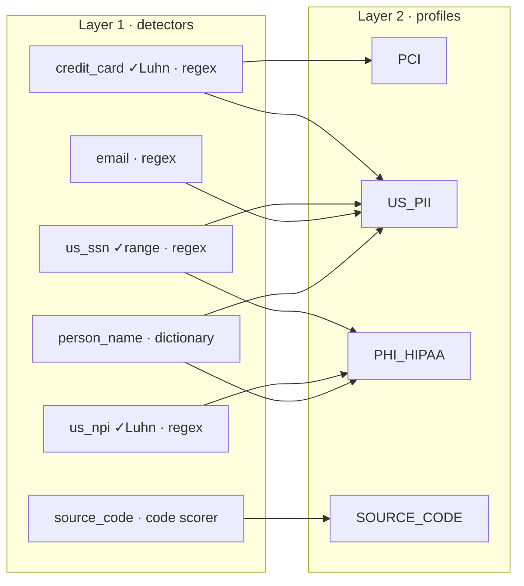
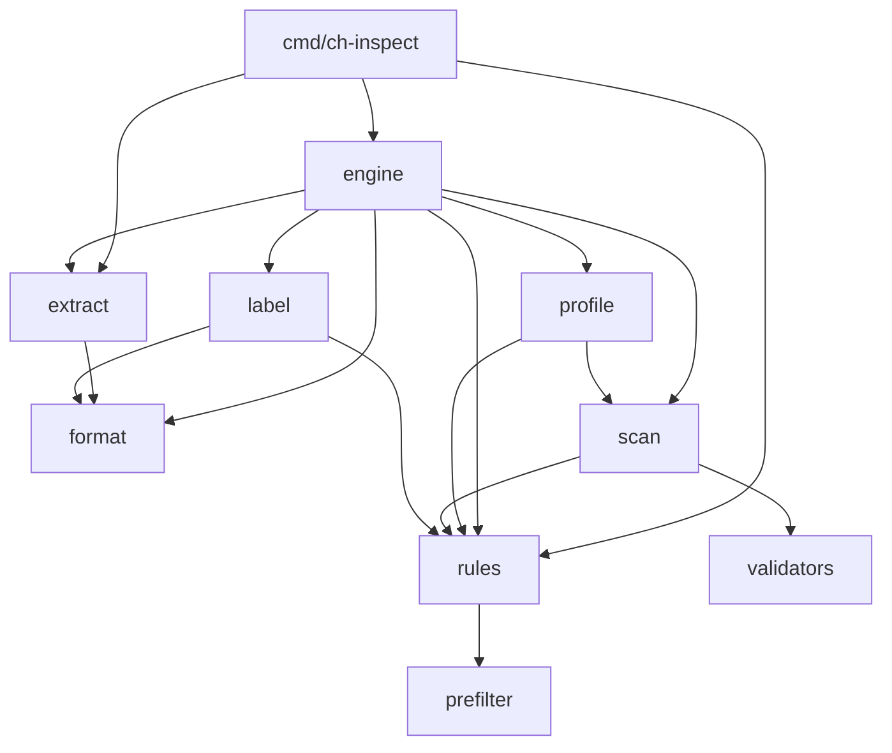

# Architecture

`endpoint-ci` is a local content-inspection engine: given a file, it detects
sensitive data types, composes them into named profiles, and returns a **match
report** — *what* it found, with confidence — entirely offline. It reports only;
the block/allow/quarantine decision is made by a separate policy engine that
consumes the report (see [`../DECISIONS.md`](../DECISIONS.md) 2026-07-07).

## Inspection pipeline


```mermaid
flowchart TD
    A[file bytes] --> B[format.Detect<br/>magic bytes]
    B --> C[extract.Extract<br/>text per type + size gate]
    C -->|raw bytes| L[label.Metadata<br/>OOXML docProps / PDF XMP]
    C -->|text| P[prefilter<br/>Aho-Corasick literals + needs-digit]
    P --> S[scan.ScanDetectors<br/>parallel, match-capped]
    S --> PR[profile.Evaluate<br/>and/or/min compositions]
    PR --> V[engine Report<br/>matched profiles + confidence + evidence]
    L --> V
    V --> O[Report JSON]
```

Key points:
- **Format detection** is by magic bytes (`%PDF`, `PK\x03\x04` → OOXML, `D0CF11E0`
  → OLE/encrypted, else UTF-8 text).
- **Extraction** turns a file into inspectable text: plaintext directly, OOXML via
  `archive/zip` + tag stripping, PDF via the text layer. Files over the **size gate**
  are reduced to head+tail windows (`Partial`).
- The **label fast-path** runs on the *raw* container (document properties / XMP
  packet), independent of body extraction — so a labelled-but-unparseable file is
  still caught.
- Detectors run in **priority-ordered batches** with **early-exit**: once a
  high-confidence match is found (`stop_on_high_confidence`), remaining detectors are
  skipped and the report is flagged `short_circuited`.

## Two-layer detection model

Breadth (PII, HIPAA, PCI…) comes from *composition*, not from giant patterns.


```mermaid
flowchart LR
    subgraph L1[Layer 1 · detectors]
      d1[credit_card ✓Luhn · regex]
      d2[us_ssn ✓range · regex]
      d3[email · regex]
      d4[us_npi ✓Luhn · regex]
      d5[person_name · dictionary]
      d6[source_code · code scorer]
    end
    subgraph L2[Layer 2 · profiles]
      p1[PCI]
      p2[US_PII]
      p3[PHI_HIPAA]
      p4[SOURCE_CODE]
    end
    d1 --> p1
    d1 --> p2
    d2 --> p2
    d2 --> p3
    d3 --> p2
    d4 --> p3
    d5 --> p2
    d5 --> p3
    d6 --> p4
```

- **Detector** — one recognisable data type, of one of three **kinds**:
  - `regex` — an RE2 pattern + optional checksum validator + context keywords
    (credit_card, us_ssn, email…).
  - `dictionary` — a gazetteer scorer for things regex can't pin down (person_name).
  - `code` — a language-agnostic **scoring classifier** for program source
    (`source_code`); see below. Source code has no checksum, so like the dictionary
    kind its confidence comes from combined evidence, not a validator.
  Each detector emits a confidence score and a `fired` flag.
- **Profile** — a boolean tree (`and` / `or min=N` / `detector` with
  `min_validated` / `min_count`) over fired detectors. It is a named concept with a
  `data_type`; it carries **no** action/ceiling — the engine reports matches, it does
  not decide actions.

Confidence model (`config/rules.json → confidence_model`): start at the detector's
`base_confidence`, `+10` if a validator passes, `+5` if a context keyword is near a
match, `+5` per extra match (max 3); a detector fires at ≥ `default_fire_threshold`
(50). A profile match at ≥ `high_confidence_threshold` (65) is flagged
high-confidence in the report (a detection-quality signal, not an action).

## Package dependency graph


```mermaid
flowchart TD
    cmd[cmd/ch-inspect] --> engine
    cmd --> extract
    cmd --> rules
    engine --> extract
    engine --> format
    engine --> label
    engine --> profile
    engine --> rules
    engine --> scan
    profile --> scan
    profile --> rules
    scan --> rules
    scan --> validators
    extract --> format
    label --> format
    label --> rules
    rules --> prefilter
```

`engine` orchestrates; everything below it is a focused, independently-testable unit.
`format`, `validators`, and `prefilter` are leaves (standard library only). The sole
third-party dependency (`ledongthuc/pdf`) is used only inside `extract`.

| Package | Responsibility |
|---|---|
| `rules` | load `rules.json`, classify pattern RE2-compatibility, build the prefilter automaton |
| `format` | magic-byte file-type detection |
| `extract` | text extraction per type + size gate / head-tail |
| `prefilter` | Aho-Corasick multi-literal matcher (skip detectors that can't match) |
| `scan` | run detectors (parallel, match-capped), apply validators + confidence |
| `validators` | deterministic checksums (Luhn, IBAN, ABA, SSN, NPI, NIR, …) |
| `profile` | evaluate composition trees over detector results |
| `label` | sensitivity-label detection (OOXML docProps, PDF XMP, body) |
| `engine` | pipeline orchestration, early-exit, match Report assembly |

## Report assembly

The engine assembles a `Report` — it never emits an action. Each matched profile is
reported with its `data_type`, `confidence`, and contributing leaf `rules`; a match
at ≥ `high_confidence_threshold` (65) is flagged high-confidence.

```
report.profiles  = matched profiles (id, data_type, confidence, rules[])
report.detectors = fired leaves (id, data_types[], raw/validated counts, confidence)
report.labels    = sensitivity labels (source = metadata | body)
# neutral scan facts the policy layer weighs — not actions:
report.readable        = false if encrypted / corrupt / binary (no body inspected)
report.coverage        = full | partial (size gate) | truncated
report.short_circuited = scan stopped early on a high-confidence match
```

States that used to be ESCALATE are now facts: encrypted/unreadable → `readable:false`;
incomplete coverage → `coverage:"partial"`; a weak match → simply reported below the
threshold. What to *do* with a report (block/quarantine/allow) is decided by a
separate **policy engine** — this component reports only (see
[`../DECISIONS.md`](../DECISIONS.md) 2026-07-07).

## Performance & robustness mechanisms

- **Prefilter** (one Aho-Corasick pass) skips detectors whose literal cue / digit
  requirement is absent.
- **Match cap** (`FindAllStringIndex(text, 64)`) stops scanning once enough matches
  exist — we don't need all 2,000 cards to know it's PCI.
- **Parallel scan** across `NumCPU` (detectors are independent & read-only).
- **Early-exit**: priority-ordered batches; stop when a high-confidence match is
  found (`stop_on_high_confidence`) or matches saturate `max_total_matches`.
- **Size gate** bounds work on huge files; **process isolation** in `--scan` bounds
  the blast radius of a malicious file (e.g. a PDF that OOMs the parser).

See [`engine-notes.md`](./engine-notes.md) for measured numbers and findings, and
[`../CONTRIBUTING.md`](../CONTRIBUTING.md) for how to add detectors/profiles.
